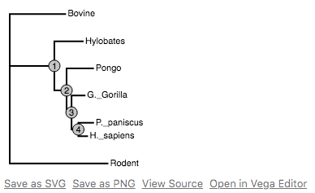

# PhyloVega

**Visualize phylogenetic trees in Vega from Python.**

Declarative tree visualizations in Python powered by Vega.

**Declarative Grammar**

```python
from phylovega import TreeChart

# Construct Vega Specification
chart = TreeChart.read_newick(
    'tree.newick',
    height_scale=200,

    # Node attributes
    node_size=200,
    node_color="#ccc",

    # Leaf attributes
    leaf_labels="id",

    # Edge attributes
    edge_width=2,
    edge_color="#000",
)

chart.display()
```




**Interactive trees**

Use Vega grammar


## How does it work?

PhyloVega defines a Vega grammar (specifically, a set of transforms) to draw phylogenetic trees. 

## Why?

Python is due for a simple, interactive phylogenetic tree viewer. Vega has done
most of the heavy lifting here. PhyloVega simply leverages Vega transform specifications for building interactive visualizations.

## In the works

Here is a list of features that will eventually make it into PhyloVega.

* More Interactivity
* Collapible Clades.
* Circular trees
* ... (feel free to add to this list).

## Install

Get the latest release with `pip`:

```
pip install phylovega
```

Install the development version by cloning this repo and calling:
```
pip install -e .
```

## Dependencies

PhyloVega uses the Vega4 specification. It works out-of-the-box with JupyterLab. 

* [JupyterLab](): The next generation Jupyter notebook.
* [PhyloPandas](https://github.com/Zsailer/phylopandass): Pandas DataFrame for Phylogenetics